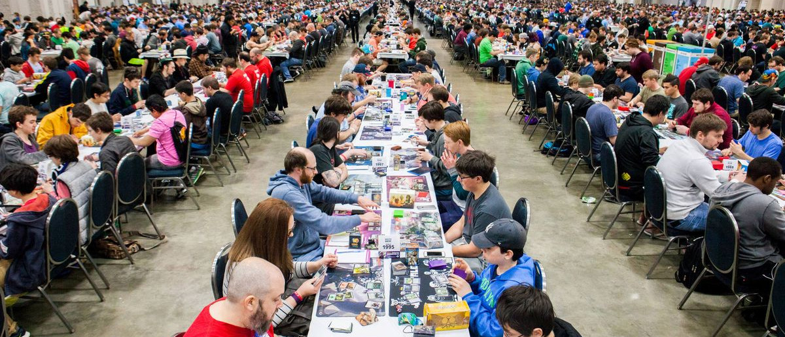

# **The Original Trading Card Game**

Concieved and developed by mathematician Richard Garfield, **Magic: the Gathering** (commonly known as *MTG* or simply *Magic*) is a trading card game released by Washington State-based game publisher Wizards of the Coast (WotC). The game was debuted at a GenCon gaming convention on August 5, 1993 and by the end of October 1993, WotC had sold out of their initial run of 10 million cards. By the end of 1994, Magic: the Gathering had sold over 1 billion cards.

Not only does *MTG* still enjoy popularity - and regularly released sets of new cards - to this day, but it was the first of its kind, paving the way for other successful titles such as *Yu-Gi-Oh* and the *Pokémon Trading Card Game*, and many more that have come and gone over the years.   

  

---
## **Background & Motivation**

*Magic* became a part of my life at a young age and it wasn't long before I was playing competitvely in sanctioned events. First at local collectables stores and later traveling to larger events, often in neighboring states, which I continued to do for over a decade. It has been some years since I played in this context, but over the years I met many other players who remain close friends to this day, and the game remains very close to my heart.

*Magic* is a game of both skill and chance, where decisions made by a player can have consequences many turns on. Each player has their own deck to draw from, and the decks are not (necessarily) identical, but built by the individual player from a larger pool of available cards. After over 25 years of printing, there are tens of thousands of cards to choose from.
 

#### **Rarity as an Attribute**

Being a trading card game, a big part of *MTG* is collectability and, naturally, a big part of collectability is the scarcity or rarity of a collectible item. *Magic* cards are printed with a predetermined rarity set by Wizards of the Coast. This is somewhat an indication of how 'powerful' or how effective a card would be in a competitive setting. More concretely, it's an indication of how many of that card was manufactured, as fewer copies of a rare card are printed than those of a common card.

For this project, I will explore 